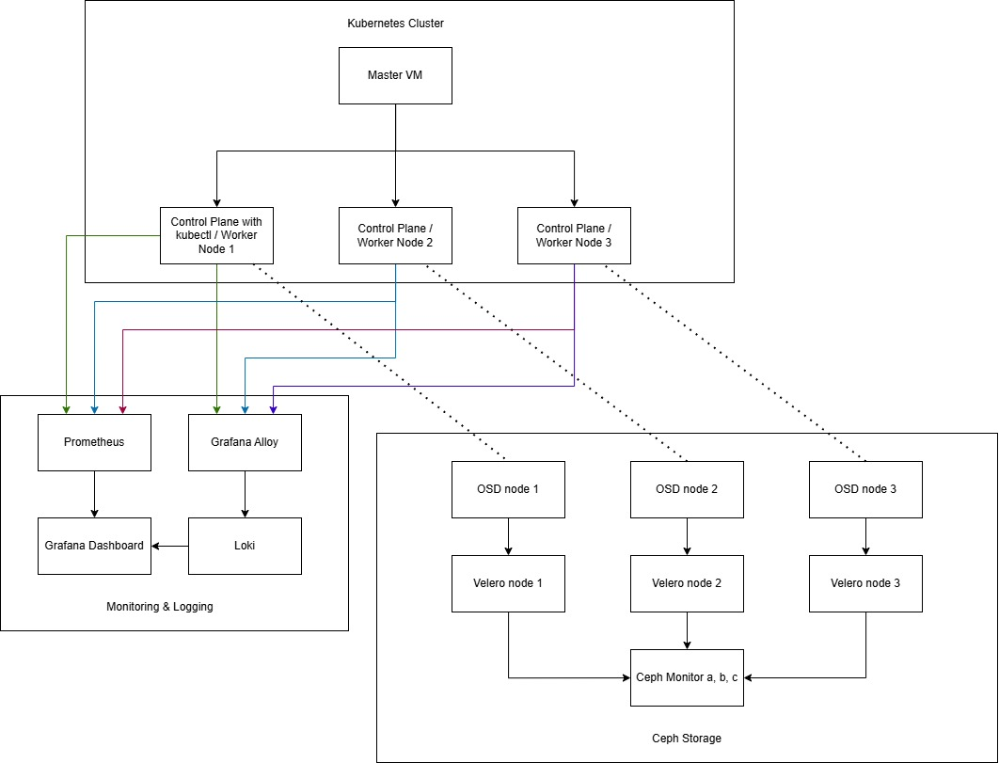

**Infrastructure as Code - Kubernetes with Ceph**

Kort introduksjon

I løpet av dette prosjektet har vi tatt i bruk ulike verktøy; Ansible for orkestrering av infrastrukturen, Terraform for å sette opp ressursene i Openstack, Kubernetes for orkestrering av pods for overvåking, lagring (Ceph) og backup (Velero/minIO). Målet var å opprette et system som er klar for å sette opp i produksjon.

**Hurtig oversikt**

- plays/: Ansible-playbooks for å konfigurere noder, installere service og sette opp clusters.
- terraform/: konfigurasjon for å etablere de virtuelle maskinene og output/variables for dynamisk tildeling av ip-adresser.
- rook-manifests/: Rook/Ceph-manifester for distribuert lagring.
- velero-backup/ Verktøy for Velero backup og restore.
- grafana/: Dashboard for overvåkning og logging.

**Forutsetninger**

- Lokalt eller fjernmiljø med Linux-servere som fungerer som Kubernetes-noder.
- Ansible installert på kontrollmaskinen.
- Terraform installert for infrastruktur-oppgaver.
- kubectl for å anvende manifest og sjekke klyngestatus.

**Arkitekturoverview**

**Arkitektur-beskrivelse:**

- Node 1 styrer Kubernetes med controlplane
- Worker noder kjører applikasjoner og Ceph OSDs (Object Storage Daemons)
- Velero er satt opp til å ta backups med bruk av MinIO
- Prometheus samler metrics som Grafana visualiserer
- Kubernetes tilbyr høy tilgjengelighet ved å replikere applikasjonene på alle noder (1 replikasjon på hver node).

**Hvordan bruke repoet**

Kjør relevante Ansible-playbooks med main.yml eller fra plays/ for å initialisere noder:

- ansible-playbook main.yml
- ansible-playbook -i hosts.ini plays/worker.yml

**Bruk Terraform i terraform/ for å gjøre endringer på infrastruktur:**

- cd terraform
- terraform init
- terraform apply

Importer Grafana-dashboardene fra grafana/dashboard.json for overvåkning.

**Rook/Ceph-flow:**

- Pod ber om lagring via PersistentVolumeClaim (PVC)
- StorageClass ceph-rbd definerer at dette skal være Ceph RBD-blokk
- Operator oppfatter kallet og opprettet RBD-volum
- Ceph OSDs distribuerer og repliserer data
- Ceph Monitor koordinerer klyngen

**Backup med Velero**

- Backup-workflow:
- Velero tar snapshots av Kubernetes-ressurser on demand
- Backups sendes til MinIO (eller S3-kompatibel objektlagring)
- Ved katastrofe: last backup fra MinIO og restaurer alt
- Rook-volumer inkluderes i backupen
- Se velero-backup/ for MinIO-setup og backup-policies.
- Overvåkning med Grafana

**Monitoring-flow:**

- Node Exporter samler CPU, memory, disk-metrics
- kube-state-metrics gir kubernetes status
- Prometheus lagrer alle metrics i tidsserie-database
- Grafana leser Prometheus og viser dashboards
- Dashboard-definisjoner finnes i grafana/dashboard.json og kan importeres direkte i Grafana.

**Deployment oversikt**
Deployment-rekkefølge:

- Ansible – installer kjører terraform konfigurasjonene og setter opp Kubernetes og nettverk
- Terraform – opprett infrastruktur (servere/noder)
- Rook Manifests – opprett distribuert lagring
- Velero – sett opp backup-system med MinIO
- Grafana – aktiver overvåkning og dashboards

**Hva vi lærte**

- Hvordan man kan konfigurere kubernetes klyngene ved å tildele minne og cpu når ressursene er begrenset for å få klyngen til å fungere.
- Sette opp infrastruktur med deklarativ kode
- Hvordan sette opp blokklagring i Kubernetes med Ceph og samtidig sørge for høy tilgjengelighet
- Hvordan samle metrics og logging for oversikt via Grafana.

**Valg og begrunnelser**

- Gitlab for lagring av repository: Gitlab tilbyr en enkelt oppsett av runners som kunne integreres i pipeline for oppsett av infrastrukturen når koden committes til repository. Alternativer: GitHub tilbyr mye av de samme funksjonene som Gitlab.
- Ansible for konfigurasjon: Ansible gir enkel SSH basert automatisering. Alternativer: Puppet som alternativ dersom konfigurasjon for agent-based modell. Tilbyr desired state løsning hvor man definerer hvordan systemet skal konfigureres og puppet sørger for at den ønskede tilstanden opprettholdes.
- Ceph for lagring: Ceph tilbyr en robust, selvhelbredende og skalerbar blokk-, objekt- og fillagring i én og samme løsning. Alternativer: GlusterFS er enklere å sette opp enn Ceph hvis man kun trenger et delt filsystem.
- Velero for backup: God kompabilitet med Ceph. Alternativer: Bacula som er programvare for sikkerhetskopiering og gjenoppretting og tilbyr skalerbar backup og gjenoppretting.

**Videre arbeid og forbedringer**

- Automatisere testing av playbooks og Terraform med CI-pipeline før deploy.
- Migrere kodebasen fra custom ansible oppsett til å deploye infrastrukturen med Kubespray for en problemfri oppsett av kubernetes nettverk.
- Vurdere å bruke CICD pipeline for å deploye infrastruktur og holde konfigurasjonen i Gitlab Repository.

